 
* TOC
{:toc}
---
 
# 现象
 
 MachOView查看Facebook的可执行文件，发现 FBInjectable 和 fbsessiongks 的数据段，这篇文章就探索下 FBInjectable 数据段的产生与用途。
 
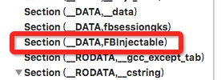


# 如何定位

设备：iPhone5 越狱 iOS8.4 armv7

## 砸壳

Clutch 或 dumpdecrypted，获取到未加密的Facebook armv7 可执行文件。

## 初步查找 strings

使用strings 搜搜关键词FBInjectable，可知可以通过字符串作为切入点。

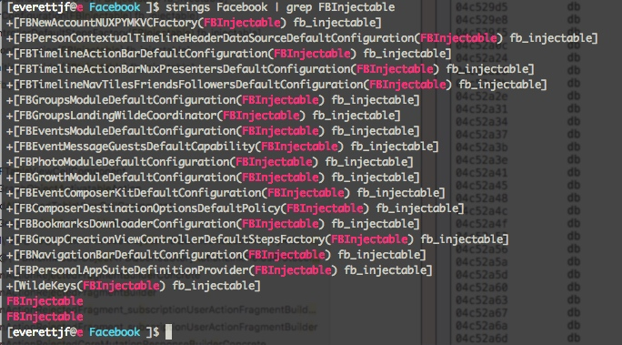


## 使用Hopper和IDA分析

使用Hopper和IDA分析好。两个App各有优缺点，配合使用。

分析较慢，我的MBP CPU2.2 i7 分析1个小时以上。

分析完成后就可以畅游arm了。

## Hopper中初步定位

搜索字符串FBInjectable

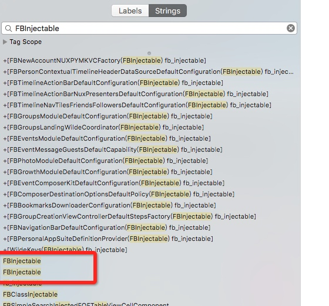

查看存在交叉引用的一个

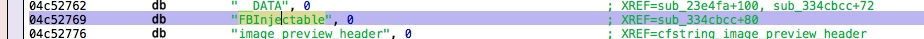

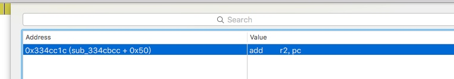

跳转过去查看，可知地址在 0x0334cc1c，且FBInjectable是作为 getsectiondata 的第三个参数。

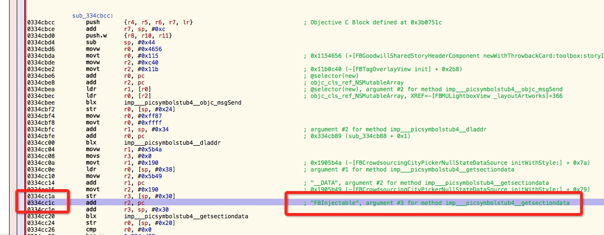

getsectiondata 的调用地址为 0x0334cc20。

getsectiondata 的定义如下：

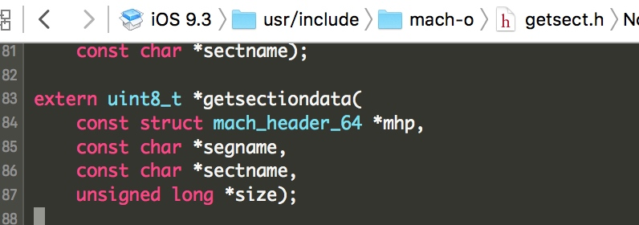

反汇编：

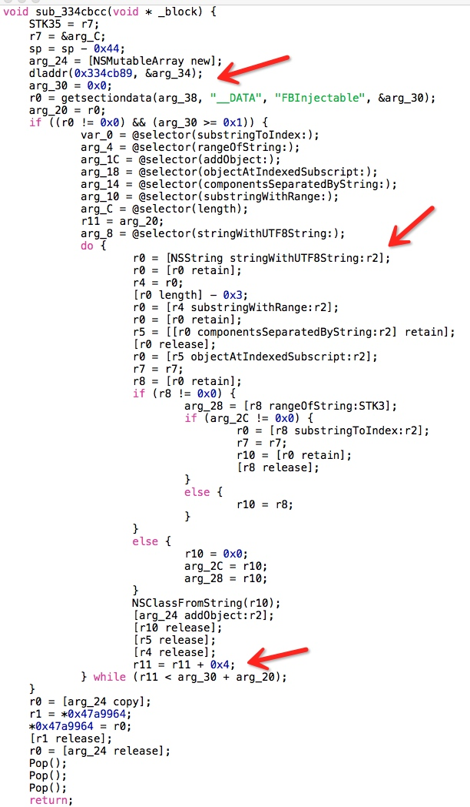


需要重点关注下，r11这个变量。Hopper反汇编的代码貌似丢掉一些很关键的r2的信息。但看完能大概知道这里在遍历 getsectiondata的返回值，每4个字节做了一些处理。

如果IDA 有F5 反汇编功能，可以看到下图。这里没有丢掉关键的信息。v19作为返回值，转换为DWORD指针（做Windows开发比较熟悉，double word，word 是双字节，DWORD就是四字节），然后又把这个指针解引用。

也就是把getsectiondata的返回值buffer中的前四个字节当做字符串的内存地址。

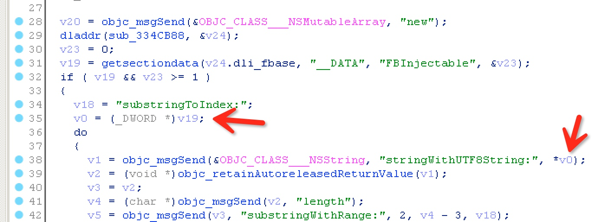


## lldb 确认getsectiondata返回值

为确认Facebook启动后是否调用了 getsectiondata，并传入了FBInjectable，可以先条件断点。

使用debugserver启动App：

```
everettjfs-iPhone:~ root# debugserver -x backboard *:1234 /var/mobile/Containers/Bundle/Application/A7811200-13B6-4053-BAED-8D3E8DE7C929/Facebook.app/Facebook
```

添加条件断点：

```
70 = F
95 = _

(lldb) br set -n getsectiondata -c '(int)*(char*)$r2 == 70'
```

继续运行，发现可以断下来。

单步运行，打印返回值 r0的数据。
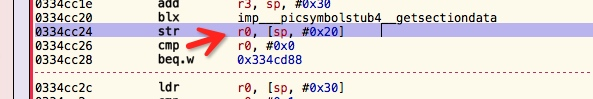

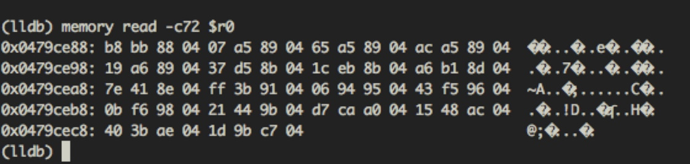

 到这里我们发现个问题，与FBInjectable section的数据不一样。
 
 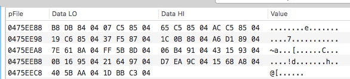

但发现个规律，每4位相减正好是 ASLR 偏移地址。

也就是说 FBInjectable 数据段 的数据在调用getsectiondata之前就被修改了。这里暂且忽略修改的方法（下文会介绍一种修改方法），继续探索。

打印当前方法的 返回值。
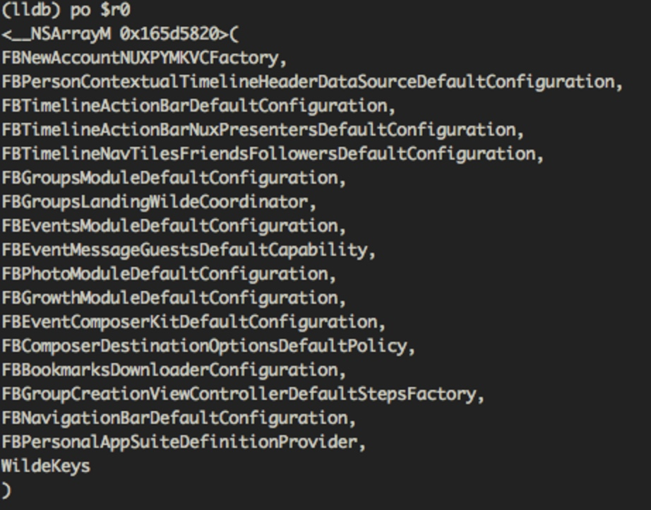

可见这里与开始strings查找FBInjectable时的结果很相似，


PS：这一步使用条件断点会导致启动特别慢。但条件断点的目的只是为了确认是否有这个调用。由于调试中要多次启动App，也可以直接断点到目标地址。（启动时，先断点到start，然后image list 查看ASLR偏移地址，再计算出getsectiondata的地址，然后 br s -a ADDRESS）

## 初步结论

由此可知，FBInjectable中存储的是
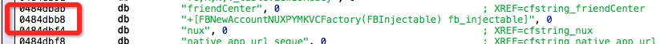

这类字符串的地址，armv7（32位）下每个地址占用4个字节，上图18个地址总共占用72个字节。通过FBInjectable的数据可以获取到这18个字符串。


## class-dump查看

在头文件中搜索fb_injectable，

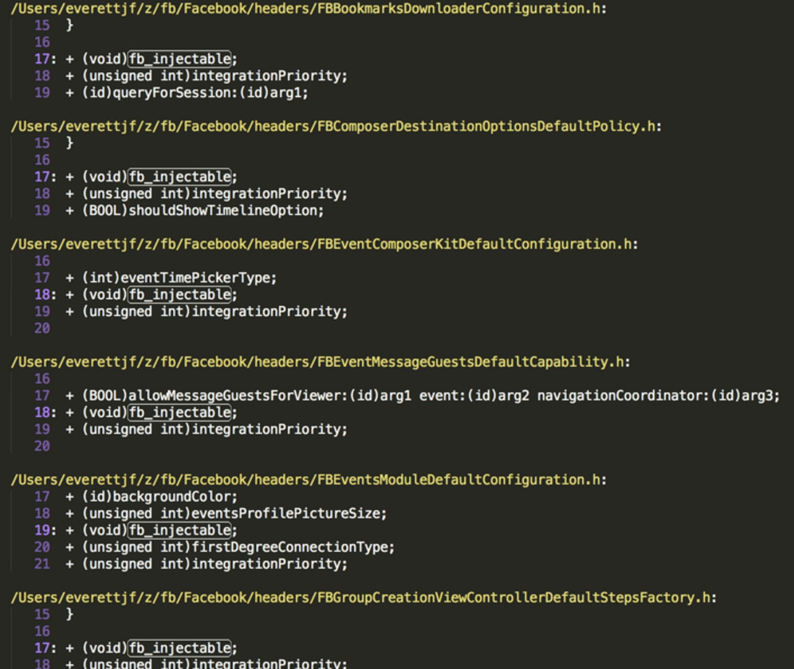


## 再看lldb调用栈


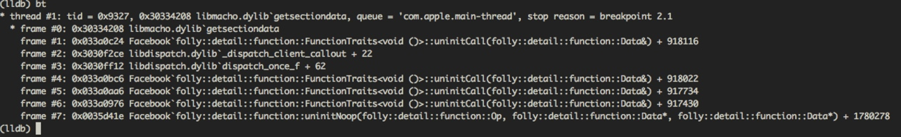

图中看到好多folly的符号，folly是Facebook开源的专注于性能的C++ Library，但不知为何会对lldb的符号有这么大的影响。（有时间需要进一步了解下lldb的符号如何查找的）。不过，地址都是正确的。可以通过frame中的地址减去ASLR偏移地址，得到文件中的地址。

根据调用堆栈，可以跟踪到如下位置：

这里跨度可能有点大，但仔细定位那些frame的地址，可以看到下图内容（18个流程中的一个）。

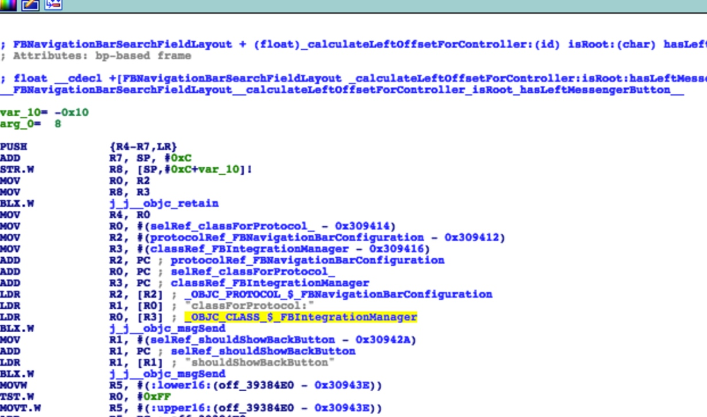
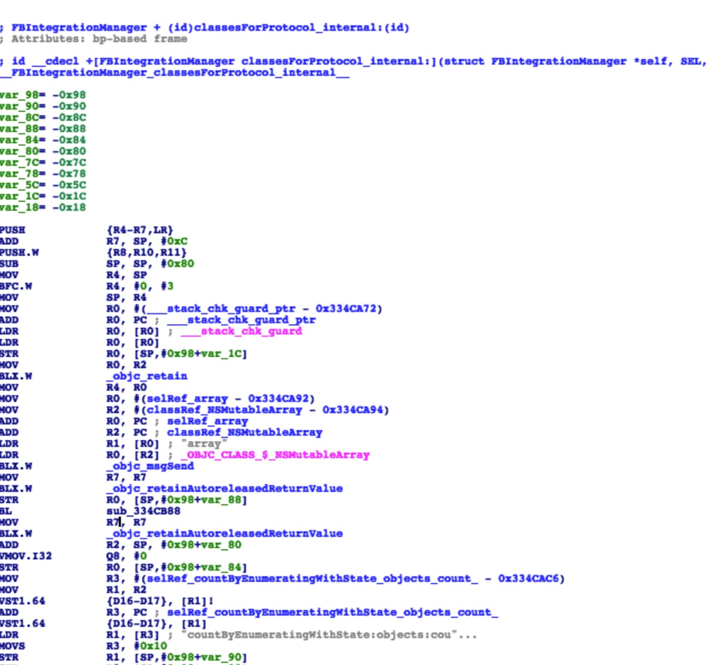

大概流程如下：

FBNavigationBarSearchFieldLayout 类的

```
+ (float)_calculateLeftOffsetForController:(id)arg1 isRoot:(BOOL)arg2 hasLeftMessengerButton:(BOOL)arg3;
```

调用了 FBIntegrationManager 类的

```
+ (Class)classForProtocol:(id)arg1;
```

以及

```
+ (id)classesForProtocol_internal:(id)arg1;
```

classesForProtocol_internal 会在首次调用时（dispatch_once）时加载FBInjectable的内容并获取这18个字符串，进而转化为对应的类。


# 结论

fb_injectable 只是个标记。


# 用途


# 例子


# 总结

以上步骤只是我在探索后重新整理的步骤，真正探索过程中可能步骤相互穿插。

